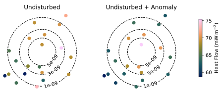

======================
Anomaly quantification
======================

:mod:`reheatfunq.anomaly`
-------------------------

.. py:module:: reheatfunq.anomaly

.. role:: python(code)
   :language: python

The :mod:`reheatfunq.anomaly` module contains functionality to analyze the
strength of heat flow anomalies using the
:class:`~reheatfunq.regional.GammaConjugatePrior` model of regional aggregate
heat flow distributions. The module contains the workhorse
:py:class:`HeatFlowAnomalyPosterior` for Bayesian heat flow anomaly strength
quantification and :py:class:`AnomalyLS1980` class to model a fault-generated
conductive heat flow anomaly [LS1980]_.
The class :py:class:`AnomalyNearestNeighbor` can be used to include the results
of an external heat flow anomaly modeling (finite elements etc.) in the
REHEATFUNQ analysis.
The workflow for anomaly quantification using REHEATFUNQ consists of the
following steps:

1. Define the :math:`d_\mathrm{min}`
   (e.g. :math:`{d_\mathrm{min} = 20\,\mathrm{km}}`)
2. Define the conjugate prior to use. Obtain a
   :py:class:`~reheatfunq.regional.GammaConjugatePrior`
   instance (e.g. using the REHEATFUNQ default from
   :py:func:`~reheatfunq.regional.default_prior`).
3. Model the fault-generated heat flow anomaly. So far, the
   :py:class:`AnomalyLS1980` and :py:class:`AnomalyNearestNeighbor` are
   available for this purpose.
4. Compute the marginal posterior in :math:`P_H` using the
   :py:class:`HeatFlowAnomalyPosterior` class, which takes into consideration
   the bootstrapped updating of the gamma conjugate prior over the set of
   :math:`d_\mathrm{min}`-conforming subsets of the heat flow data.

Vertical Strike-Slip Fault
""""""""""""""""""""""""""

Exemplarily, the following code summarizes the analysis using a heat flow
anomaly for a vertical strike-slip fault [LS1980]_. First, we generate some
toy heat flow data following a gamma distribution. We use the same heat flow
data as in the :mod:`reheatfunq.regional` example:

.. code :: python

   import numpy as np
   from reheatfunq.anomaly import AnomalyLS1980
   rng = np.random.default_rng(123920)
   alpha = 53.3
   qu = rng.gamma(alpha, size=15)
   x = 100e3 * (rng.random(15) - 0.5)
   y = 100e3 * (rng.random(15) - 0.5)

Generate an obliquely striking vertical strike slip fault and the corresponding
conductive heat flow anomaly for a linearly increasing heat production with
depth [LS1980]_:

.. code :: python

   fault_trace = np.array([(-20e3, -100e3), (20e3, 100e3)])
   anomaly = AnomalyLS1980(fault_trace, 14e3)
   xy = np.stack((x,y), axis=1)

The data and anomaly look like this (dashed black lines indicate the contours of
the heat flow anomaly :math:`c_i=\Delta q_i / P_H` and the blue line shows the
fault trace):

.. image:: ../_images/example-q_x_y-anomaly.svg

Now compute three sets of heat flow data superposed by heat flow anomalies of
:math:`90\,\mathrm{MW}`, :math:`150\,\mathrm{MW}` and :math:`300\,\mathrm{MW}`
power:

.. code :: python

   dq = anomaly(xy)
   q1 = qu +  90e6 * dq * 1e3
   q2 = qu + 150e6 * dq * 1e3
   q3 = qu + 300e6 * dq * 1e3

Now compute the marginalized posterior distribution of the heat-generating power
:math:`P_H` for the data superposed with the three anomalies:

.. code :: python

   from reheatfunq.anomaly import HeatFlowAnomalyPosterior
   from reheatfunq import default_prior
   gcp = default_prior()
   post1 = HeatFlowAnomalyPosterior(q1, x, y, anomaly, gcp)
   post2 = HeatFlowAnomalyPosterior(q2, x, y, anomaly, gcp)
   post3 = HeatFlowAnomalyPosterior(q3, x, y, anomaly, gcp)

   P_H = np.linspace(0, 600e6, 200)
   pdf1 = post1.pdf(P_H)
   pdf2 = post2.pdf(P_H)
   pdf3 = post3.pdf(P_H)

The vertical dashed lines indicate the true anomaly powers.

A detailed use of the anomaly quantification can be found in the Jupyter
notebook
`jupyter/REHEATFUNQ/06-Heat-Flow-Analysis.ipynb
<https://github.com/mjziebarth/REHEATFUNQ/blob/master/jupyter/REHEATFUNQ/06-Heat-Flow-Analysis.ipynb>`_.

Custom Heat Flow Anomaly
""""""""""""""""""""""""

The next example shows how to use REHEATFUNQ with a heat flow anomaly that has
been computed using external code. This is done using the
:py:class:`AnomalyNearestNeighbor` class, and the heat flow anomaly should be
specified in terms of the factors :math:`c_i` (i.e. :math:`\Delta q_i / P_H`).
For this purpose, we generate a Gauss-shaped heat flow anomaly that leads to
an additional heat flow of :math:`68.3\,\mathrm{mW\,m}^{-2}` at its center
when fed by :math:`10\,\mathrm{MW}` of heat-generating power:

.. code :: python

   def anomaly_ci(x,y):
       return 68.3e-3 / 10e6 * np.exp(-(x**2 + y**2))

Note here that the :math:`c_i` should be specified in basic SI units.

We generate some new data superposed by a :math:`10\,\mathrm{MW}` heat flow
anomaly:

.. code :: python

   N = 20
   rng = np.random.default_rng(123329773)
   xy = 3 * rng.random((N,2)) - 1.5
   q0 = 0.39 * rng.gamma(175.2, size=N)
   c_i = anomaly_ci(*xy.T)
   q = q0 + 1e3 * 10e6 * c_i

To adjust the analysis to a custom set of heat flow anomaly factors :math:`c_i`
in :math:`\mathrm{m}^{-2}`, it is sufficient to replace the line
:python:`c_i = anomaly_ci(*xy.T)` with whatever code computes or loads the
factors. The shape of :python:`c_i` should be compatible to :python:`(N,)`.

The point set and anomaly generated by the above code should look like this:

With the anomaly factors :math:`c_i` evaluated at the data locations, we can
perform the REHEATFUNQ anomaly analysis using the
:py:class:`AnomalyNearestNeighbor` class:

.. code :: python

   from reheatfunq.anomaly import AnomalyNearestNeighbor
   xyc = np.stack((*xy.T, c_i), axis=1)
   ann = AnomalyNearestNeighbor(xyc)
   hfap = HeatFlowAnomalyPosterior(q, *xy.T, ann, gcp, dmin=0.0)

The analysis recovers the anomaly strength:

|

.. role:: python(code)
   :language: python

.. autoclass:: reheatfunq.anomaly.HeatFlowAnomalyPosterior
   :members:

|

.. autoclass:: reheatfunq.anomaly.anomaly.Anomaly
   :members:

   .. method:: __call__(xy, P_H = 1.0)

      Evaluate the heat flow anomaly at a set of points for
      a given heat-generating power :python:`P_H`.

      :param double[:,:] xy: Locations at which to evaluate the
                             heat flow anomaly.
      :param float P_H: The heat-generating power (in W).
      :return: The anomalous heat flow evaluated at the locations,
               :math:`\{\Delta q_i\} = \{c_i P_H \}`.
      :rtype: :class:`numpy.ndarray`

|

.. autoclass:: reheatfunq.anomaly.AnomalyLS1980
   :members:
   :show-inheritance:

   .. method:: __call__(xy, P_H = 1.0)

      See :class:`~reheatfunq.anomaly.anomaly.Anomaly`.

|

.. autoclass:: reheatfunq.anomaly.AnomalyNearestNeighbor
   :members:
   :show-inheritance:

   .. method:: __call__(xy, P_H = 1.0)

      See :class:`~reheatfunq.anomaly.anomaly.Anomaly`.

   The use of this class is demonstrated in the quickstart Jupyter notebook
   `jupyter/Custom-Anomaly.ipynb
   <https://github.com/mjziebarth/REHEATFUNQ/blob/master/jupyter/Custom-Anomaly.ipynb>`_.