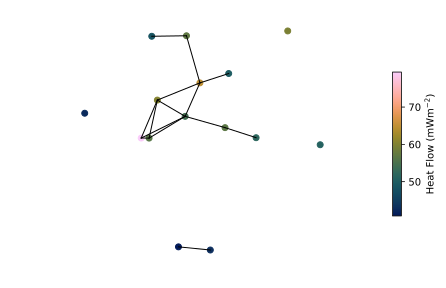
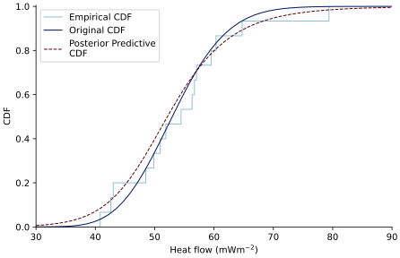

==================
Regional Heat Flow
==================

:mod:`reheatfunq.regional`
--------------------------

.. py:module:: reheatfunq.regional

The :mod:`reheatfunq.regional` module contains functionality to analyze regional
aggregate heat flow distributions using the
:py:class:`GammaConjugatePrior` and :py:class:`HeatFlowPredictive` classes.
The workflow for regional aggregate heat flow analysis using REHEATFUNQ consists
of the following steps:

1. Define the :math:`d_\mathrm{min}`
   (e.g. :math:`{d_\mathrm{min} = 20\,\mathrm{km}}`)
2. Define the conjugate prior to use. Obtain a :py:class:`GammaConjugatePrior`
   instance (e.g. using the REHEATFUNQ default from :py:func:`default_prior`).
3. Compute the posterior predictive heat flow distribution using the
   :py:class:`HeatFlowPredictive` class. This class performs the bootstrapped
   updating of the gamma conjugate prior over the set of
   :math:`d_\mathrm{min}`-conforming subsets of the heat flow data.

Exemplarily, the following code summarizes the analysis. First, we generate some
toy heat flow data following a gamma distribution:

.. code :: python

   import numpy as np
   rng = np.random.default_rng(123920)
   alpha = 53.3
   q = rng.gamma(alpha, size=15)
   x = 100e3 * (rng.random(15) - 0.5)
   y = 100e3 * (rng.random(15) - 0.5)

The resulting synthetic heat flow data should look like this:

Next, the :py:class:`GammaConjugatePrior` and :py:class:`HeatFlowPredictive`
classes can be used to evaluate the regional aggregate heat flow distribution
from this data:

.. code :: python

   from reheatfunq.regional import (GammaConjugatePrior,
                                    default_prior,
                                    HeatFlowPredictive)
   gcp = default_prior()
   predictive = HeatFlowPredictive(q, x, y, gcp, dmin=20e3)

   qplt = np.linspace(35, 85)
   cdf = predictive.cdf(qplt)

The posterior predictive CDF is a broadened compared to the original CDF
owing to the finite sample size and averaging over alternating data points for
pairs within exclusory distance:

This image might vary slightly due to the non-fixed random number generator in
the :py:class:`HeatFlowPredictive` class.

A detailed use of the regional aggregate heat flow distribution estimation can
be found in the Jupyter notebook
`jupyter/REHEATFUNQ/06-Heat-Flow-Analysis.ipynb
<https://github.com/mjziebarth/REHEATFUNQ/blob/master/jupyter/REHEATFUNQ/06-Heat-Flow-Analysis.ipynb>`_.

|

.. role:: python(code)
   :language: python

.. autoclass:: reheatfunq.regional.GammaConjugatePrior
   :members:

|

.. autoclass:: reheatfunq.regional.HeatFlowPredictive
   :members:

|

.. autofunction:: reheatfunq.regional.default_prior