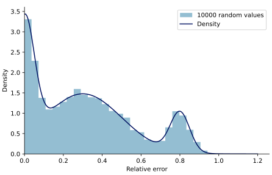

===================
Resilience Analysis
===================

.. py:module:: reheatfunq.resilience

:mod:`reheatfunq.resilience`
----------------------------

This module contains functions to evaluate the performance of the REHEATFUNQ
model for artifical gamma-distributed data, and its resilience against
non-gamma regional aggregate heat flow distributions.

The function :py:func:`test_performance_cython` can be used to investigate how
the REHEATFUNQ model performs for data drawn from a gamma distribution,
distributed randomly within a :math:`R=80\,\mathrm{km}` disk, and superposed by
an :py:class:`~reheatfunq.anomaly.AnomalyLS1980` anomaly. The sample size, the
gamma distribution parameters, and the prior parameters are the tweakable
parameters of this function. It is used in the Jupyter notebook
`jupyter/REHEATFUNQ/A3-Posterior-Impact.ipynb
<https://github.com/mjziebarth/REHEATFUNQ/blob/master/jupyter/REHEATFUNQ/A3-Posterior-Impact.ipynb>`_.

The function :py:func:`test_performance_mixture_cython` can be used to
investigate how well the REHEATFUNQ model performs if data is not drawn from a
gamma distribution but from a two-component Gaussian mixture distribution. That
is, it is a resilience test that can be tweaked to a certain class of regional
aggregate heat flow distributions. It is also used in the Jupyter notebook
`jupyter/REHEATFUNQ/A3-Posterior-Impact.ipynb
<https://github.com/mjziebarth/REHEATFUNQ/blob/master/jupyter/REHEATFUNQ/A3-Posterior-Impact.ipynb>`_.

The functions :py:func:`generate_synthetic_heat_flow_coverings_mix2` and
:py:func:`generate_synthetic_heat_flow_coverings_mix3` generate synthetic RGRDCs
that can mimic RGRDCs from real data. The two functions proceed as follows:

1. Input the structure of the real-world data RGRDC: Represent each disk by
   a tuple :math:`(N,k,\\theta)`, where :math:`N` is the sample size and
   :math:`(k,\\theta)` is the maximum likelihood estimate of the gamma
   distribution for the regional aggregate heat flow distribution associated to
   the disk.
2. Define a two-component (:code:`_mix2`) or three-component (:code:`_mix3`)
   "Gaussian" mixture distribution that describes the relative error
   distribution of the heat flow data. ("Gaussian" because we ignore the
   negative real line)
3. For a number of :code:`M` times, repeat the following steps to generate one
   synthetic RGRDC:

   - for each :math:`(N,k,\\theta)`, draw a sample from the :math:`(k,\\theta)`
     gamma distribution
   - draw a random relative error from the "Gaussian" mixture distribution
     and superpose the relative error randomly in positive or negative
     direction
   - accept or reject according to filter criteria (heat flow positivity and
     max heat flow)
   - repeat until :math:`N` heat flow values are found

The two functions are used in the Jupyter notebook
`jupyter/REHEATFUNQ/A2-Goodness-of-Fit_R_and-Mixture-Distributions.ipynb
<https://github.com/mjziebarth/REHEATFUNQ/blob/master/jupyter/REHEATFUNQ/A2-Goodness-of-Fit_R_and-Mixture-Distributions.ipynb>`_.

The function :py:func:`reheatfunq.resilience.generate_normal_mixture_errors_3`
is an interface to the generation of the three-component "Gaussian" mixture
distribution described above. An example for the distribution can be generated
from this code:

.. code:: python

   from reheatfunq.resilience import \
       generate_normal_mixture_errors_3
   X00 = 0.0
   X01 = 0.30
   X02 = 0.8
   W0 = 0.3
   S0 = 0.05
   S1 = 0.2
   W1 = 0.6
   S2 = 0.05
   X = generate_normal_mixture_errors_3(10000, W0, X00, S0, W1,
                                        X01, S1, X02, S2, 2089)

It is used in the Jupyter notebook
`jupyter/REHEATFUNQ/A2-Goodness-of-Fit_R_and-Mixture-Distributions.ipynb
<https://github.com/mjziebarth/REHEATFUNQ/blob/master/jupyter/REHEATFUNQ/A2-Goodness-of-Fit_R_and-Mixture-Distributions.ipynb>`_.

|

.. autofunction:: reheatfunq.resilience.test_performance_cython

.. autofunction:: reheatfunq.resilience.test_performance_mixture_cython

.. autofunction:: reheatfunq.resilience.generate_synthetic_heat_flow_coverings_mix2

.. autofunction:: reheatfunq.resilience.generate_synthetic_heat_flow_coverings_mix3

.. autofunction:: reheatfunq.resilience.generate_normal_mixture_errors_3